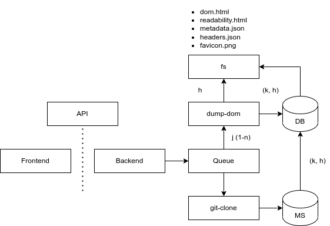

# CyberArchive - DOM Caching
#### Installation
Just execute the file `install.sh` under after setting the correct execution permissions. Tested Setup: `Debian 6.1.82-1 (2024-03-28) x86_64 GNU/Linux`.

#### Usage
```bash
$ node dump-dom.mjs https://someurl.com/
```
This will create a new folder called `SHA-256(URL)` inside the same directory. Example:
```bash
$ node dump-dom.mjs https://reddit.com
[!] Success: URL cached under /CyberArchive/ca4c460e6f3c65f7296f136e0e203b375dff565402f0c46e14cad3826697f936/

$ tree ca4c460e6f3c65f7296f136e0e203b375dff565402f0c46e14cad3826697f936/
ca4c460e6f3c65f7296f136e0e203b375dff565402f0c46e14cad3826697f936/
├── dom.html
├── readability.html
├── favicon.png
└── metadata.json

1 directory, 4 files
```
- The file `dom.html` contains a fully dump of the HTML-DOM using the Chromium webengine
- The file `readability.html` contains a reader-friendly version parsed from `dom.html` using Mozilla's "reader view"
- The file `favicon.png` contains a 32x32 favicon of the archived page
- The file `metadata.json` holds metadata about the archived page (title, timestamp)

#### Architecture

